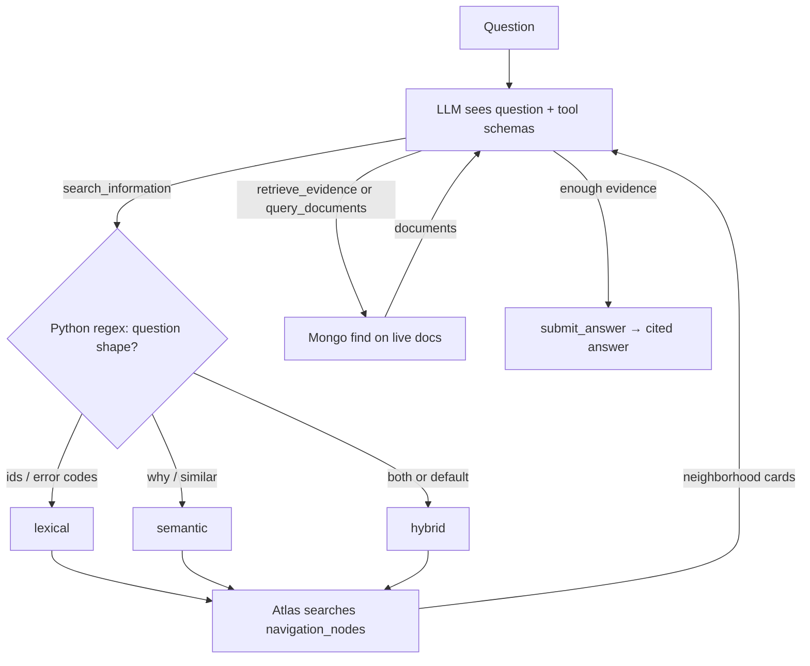

# Mongo Adaptive Retrieval Engine (MARE)

[](LICENSE)

MARE is an **agentic retrieval** layer on MongoDB: a small navigation index to find the neighborhood, then live `find` / filter / count against the source of record. It is not a cheaper chunk index.

RAG embeds every chunk and answers from Top-K. MARE embeds neighborhoods, lets the agent hop, and cites `database.collection:document_id`.

**Contents:** [Results](#results) · [When to use](#when-to-use-mare) · [Quickstart](#quickstart) · [Integrate](#integrate) · [Architecture](#architecture) · [How a question is answered](#how-a-question-is-answered)

## Results

### Demo (schema-blind agent vs hybrid RAG, K=10)

Nine cases on `mare_demo`. Vectors **616 vs 5,424** (11%).

| Case | MARE | RAG | What it tests |
| --- | --- | --- | --- |
| Named lookup / named multi-hop | yes | yes | IDs in the question. |
| **Bridge** (entity not named) | **yes** | **no** | Hop via `related_nodes`. |
| Aggregation (count enterprise) | no* | 8 (Top-K) | *Retrieved all 18; synthesizer did not count. |
| **Negative** (Cedar in April) | **yes** | **no** | Prove absence. |
| **Distributed** (Northstar) | **yes** | **no** at K=10; yes at K=20 | Lookalike customer at default K. |
| Variable-K Apex (small / medium / deep) | no / yes / yes | no† / yes / yes | †RAG K=5 complete on small; K=10 omitted the entity. |

MARE is for questions Top-K cannot structurally answer: unnamed hops, absence, distributed evidence. Named-ID lookups are a fast RAG/`find` path. Full prompts and traces: [reports/README.md](reports/README.md).

### Scale (10K incidents, LLM-on)

Same job as the product: **agent + small navigation index + Mongo tools**, not a chunk-for-chunk retrieval bake-off. Semantic nav is **604 vectors vs 60,000 RAG chunks (1%)**. Blind agent (`gpt-5-mini` tools, `gpt-5` answers) vs hybrid Top-K RAG (`gpt-5`). 20 held-out questions, 4 per category.

| | MARE | RAG |
| --- | ---: | ---: |
| Persistent vectors | **604 (1%)** | 60,000 |
| Answer correct | **19/20** | 18/20 |
| Latency | 25 s | 12 s |
| Tokens | 40.6k | 2.1k |
| Tool calls | 4.4 | 0 |

The agent matches RAG answer quality on this sample while storing far fewer vectors. Navigation finds the neighborhood (MRR in line with RAG); the loop then reads live documents and answers.

A separate retrieval-only pass (no agent) scores the navigation index as a map, not as a chunk replacement — details in [reports/scale/README.md](reports/scale/README.md).

## When to use MARE

| Question | Use |
| --- | --- |
| ID is in the prompt | RAG or `find` |
| Entity not named; need a hop | **MARE** |
| Count / filter over a collection | **MARE** (path); check the answer still counts |
| Prove nothing matched | **MARE** |
| Cause split across records; lookalike customers | **MARE** at default K; RAG if you raise K |
| “Pass the context” semantic search | RAG |

---

## Quickstart

Python 3.12+, Atlas 8.0.

```bash
python3 -m venv .venv && source .venv/bin/activate
pip install -e ".[dev]"
cp .env.example .env   # MONGODB_URI, OPENAI_API_KEY, OPENAI_MODEL=gpt-5, OPENAI_MODEL_AGENT=gpt-5-mini
python scripts/bootstrap.py
uvicorn app.main:app --reload --port 8080
curl -s localhost:8080/ask -H 'Content-Type: application/json' \
  -d '{"question":"How many customers are on the enterprise subscription tier?"}'
```

`POST /ask/rag` is the same question through conventional RAG. No API key → heuristic reasoner (tests only). Keep `MARE_SCHEMA_IN_PROMPT=false`.

## Integrate

| Endpoint | Purpose |
| --- | --- |
| `POST /ask` | Agent loop, grounded citations |
| `POST /ask/rag` | Top-K RAG baseline |
| `GET /sessions/{id}` / `.../traces` | Answer and every tool step |
| `GET /navigation/...` | Browse the hierarchy |
| `GET /metrics/vectors` | MARE vs RAG vector counts |

MCP: `python -m app.mcp_server.server`. Tools: `ask`, `search_information`, `retrieve_evidence`, `query_documents`, `read_documents`. Tenant scope is injected server-side; the model cannot widen it.

Reproduce:

```bash
python scripts/run_comparison.py              # demo cases
python scripts/run_comparison.py --informed   # schema-in-prompt control
python scripts/seed_scale.py --n 10000
python scripts/build_scale.py --n 10000 --strategy semantic --density 20 --chunk-size 512 --skip-rag
python scripts/run_scale_retrieval.py --n 10000 --budget 10 --split heldout --engine mare --density 20 --strategy semantic
python scripts/run_scale_llm.py --n 10000 --strategy semantic --density 20 --per-category 4 --split heldout
```

---

## Architecture

```text
Question → schema-blind tool loop
              ├── Navigation  (where?)  →  navigation_nodes   one vector per neighborhood
              └── Retrieval   (what?)   →  raw Mongo docs     find / filter / count / read
                         ↓
              answer + database.collection:document_id
```

RAG embeds **content fragments** (every chunk). MARE embeds **neighborhood cards** that point at live Mongo. Raw documents stay in `mare_demo` / `mare_scale`; they are never copied into the vector store.

### What gets a vector

`build_hierarchy` writes a small tree into `navigation_nodes`:

```text
database
  └── collection     schema: field names, examples, topics
        └── group    a neighborhood (customer slice on the demo; semantic prototype at 10K)
              └── optional document pointer   (tiny collections only)
```

Each node is a pointer (`database`, `collection`, `filter` / `document_ids`) plus a compact `search_text` string: name, collection, summary, important fields, entity ids, topic terms. **Not** the full document body.

Atlas then indexes that card twice, both on `search_text`:

| Index | Type | What it is |
| --- | --- | --- |
| `nav_lexical` | Atlas Search (`$search`) | Inverted index for ids, error codes, names |
| `nav_vector` | Vector Search (`$vectorSearch`) | **One** `voyage-4-lite` autoEmbed vector per node |

So 10K incidents → ~604 nav vectors vs ~60,000 chunk vectors. Demo: 616 vs 5,424. Same embedding model as RAG; far fewer rows because the unit is a neighborhood, not a chunk.

If autoEmbed is unavailable, MARE falls back to app-side embeddings. `scripts/probe_capabilities.py` records which path is active.

### How a question is answered

The LLM never sees embeddings or the navigation catalog. It sees the question and tool schemas, then discovers neighborhoods from tool results.



`search_information` runs **only on `navigation_nodes`**. Hits include `important_fields` and **`related_nodes`** (same entity, other collections) — that is the hop. `retrieve_evidence` then `find`s the **source** collection. No extra vectors. Once a field name has been seen, `query_documents` can count, filter, or return zero rows.

| Database | Role |
| --- | --- |
| `mare_demo` / `mare_scale` | System of record. Untouched. |
| `_agent_retrieval` / `_agent_scale_*` | Navigation nodes, sessions, traces. |
| `_rag_baseline` / `_rag_scale_*` | Chunk RAG, same autoEmbed model. |

```bash
pytest -q
```

```text
app/indexing/   hierarchy, topical + semantic grouping
app/search/     lexical / vector / hybrid / structured tools
app/retrieval/  agent loop
app/eval/       answer scoring + scale IR
app/baseline/   RAG
app/mcp_server/ FastMCP
```

## License

[Apache License 2.0](LICENSE).
